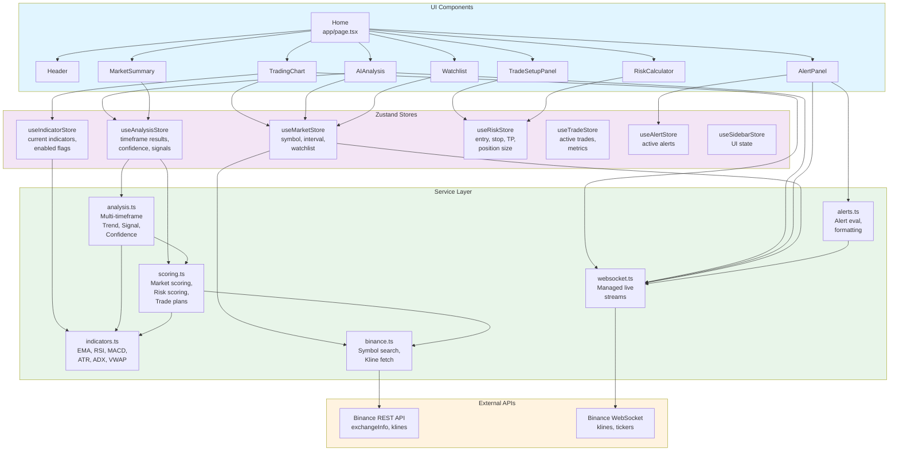
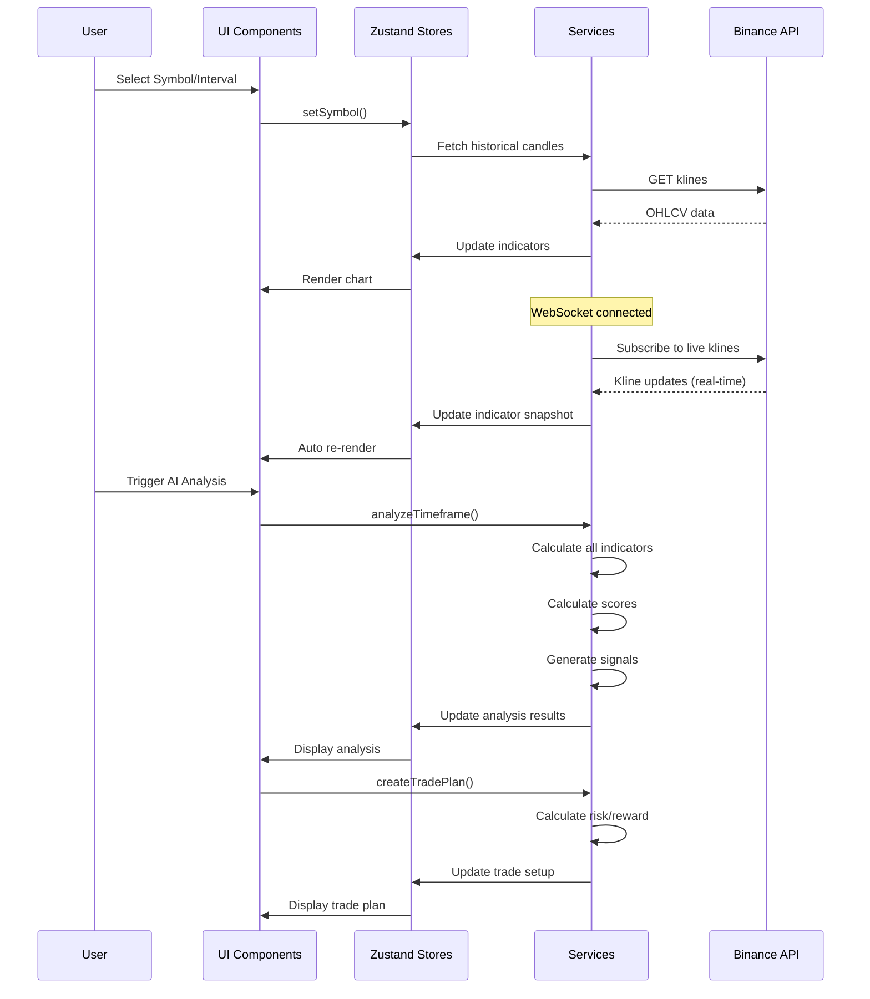
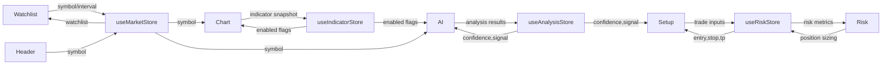

## Architecture Layers

### Presentation Layer (UI Components)
- **Home**: Root component, orchestrates all sections
- **TradingChart**: Interactive candlestick chart with indicators
- **AIAnalysis**: Multi-timeframe analysis display
- **TradeSetupPanel**: Trade entry/stop/TP configuration
- **RiskCalculator**: Position size and risk assessment
- **Watchlist**: Symbol selection and watchlist management
- **AlertPanel**: Real-time alert display
- **MarketSummary**: Market metrics and overview

### State Management Layer (Zustand Stores)
- **useMarketStore**: Market symbol and interval selection
- **useIndicatorStore**: Current indicator values snapshot
- **useAnalysisStore**: Analysis results for all timeframes
- **useRiskStore**: Trade setup inputs and calculations
- **useTradeStore**: Active trade lifecycle management
- **useAlertStore**: Alert management
- **useSidebarStore**: UI sidebar state
- **useSocketStatusStore**: Connection status (unused)
- **useLatencyDiagnosticsStore**: Performance telemetry

### Service Layer (Business Logic)
- **indicators.ts**: Pure technical indicator calculations
- **analysis.ts**: Multi-timeframe analysis engine
- **scoring.ts**: Market scoring and trade plan generation
- **websocket.ts**: Managed WebSocket connections
- **binance.ts**: Binance API integration
- **alerts.ts**: Alert evaluation and formatting
- **websocketManager.ts**: Duplicate unused socket manager

### Data Layer (External APIs)
- **Binance REST API**: Historical data, symbol information
- **Binance WebSocket**: Live candlestick and ticker streams

## Data Flow Diagram

## Component Interaction Map

## Technology Stack by Layer

| Layer | Technology | Purpose |
|-------|-----------|---------|
| **Presentation** | React 18 + TypeScript | UI components, type safety |
| **Styling** | CSS Modules | Scoped component styles |
| **State** | Zustand | State management |
| **Charts** | TradingView Lightweight Charts | OHLC visualization |
| **Framework** | Next.js 14 | Server/client, SSR |
| **Real-time** | WebSocket | Live data streaming |
| **API** | Binance REST + WebSocket | Market data |
| **Build** | ESLint, PostCSS, TypeScript | Code quality |

## Performance Characteristics

### Component Rendering
- **TradingChart**: O(n) on candle count, memoized for chart library
- **AIAnalysis**: O(n×3) for 3 timeframes, runs in parallel
- **TradeSetupPanel**: O(1) static form, no recalculation
- **Watchlist**: O(n log n) sorting on watchlist length

### Data Flow Latency
- **Historical data fetch**: ~500ms (Binance API)
- **Live kline update**: <100ms (WebSocket)
- **Indicator recalculation**: ~180ms (full snapshot)
- **UI re-render**: <50ms (Chrome, modern device)

### Memory Usage
- **Candle history**: ~100 KB per symbol (300 candles × 8 fields)
- **Indicator cache**: ~50 KB per indicator
- **Store state**: ~150 KB total
- **Total estimated**: ~800 KB - 1 MB at runtime

## Scalability Considerations

### Current Limitations
- **Single symbol analysis** (no portfolio view)
- **Single timeframe stream** (one WebSocket per chart)
- **Binance-only** (hardcoded API endpoints)
- **Browser-based** (no backend caching)

### Bottlenecks
- **API rate limits**: 1200 requests/minute
- **WebSocket connections**: Limited by browser (6-10 concurrent)
- **Calculation speed**: Indicator calc is CPU-bound
- **Memory**: Large candle histories consume RAM

### Scaling Strategy
1. **Exchange abstraction**: Create adapter pattern for multi-exchange
2. **Backend compute**: Move indicator calcs to server
3. **Caching layer**: Redis for historical data
4. **Connection pooling**: Reuse WebSocket streams across components
5. **Lazy loading**: Load candle history on-demand by timeframe
